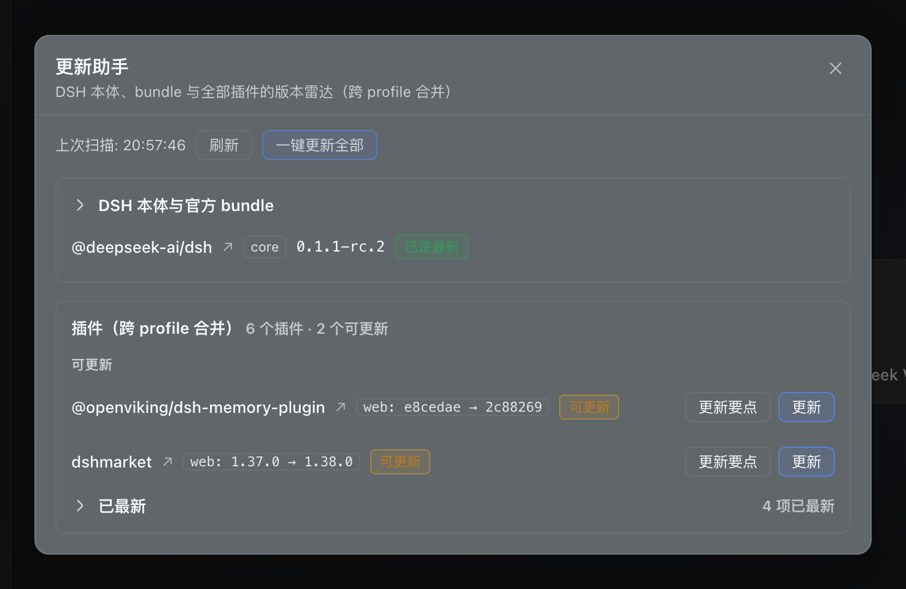

# dsh-update-copilot

[](LICENSE)
[](https://www.npmjs.com/package/@deepseek-ai/dsh)
[](lib)
[](https://github.com/hezhongtang/dsh-update-copilot/stargazers)

**[DeepSeek Harness](https://www.npmjs.com/package/@deepseek-ai/dsh) 的更新助手：追踪 dsh 本体、官方 bundle 和所有已装插件——跨全部 profile 按包合并展示，对符合独立更新条件的安装一键更新。**

<p align="center">
  
</p>

[English](README.md) | 中文

## 为什么做这个

DSH 迭代很快，插件生态同样如此。每个 profile 通过 pnpm spec 安装插件——npm 版本号、GitHub commit 锁定、本地 `link:` 目录——每种通道各有各的过期方式。手动检查意味着挨个仓库跑一遍；无脑全自动升级则等于把环境交给第三方代码。

这个插件走中间路线：**全部检测、汇总变更、只更新你点过的东西。** 更新就是一键——按钮和动作之间没有确认仪式，且只会作用于该包显示出的合格 profile。DSH 本体刻意设计为*只报告不执行*——升级 harness 会重启所有会话，这个决定必须留给人。

## 功能

| | |
|---|---|
| 🔭 **全量雷达** | 一次扫描覆盖 dsh 本体 + 官方 bundle（`dsh-base`、`dsh-web-app`）+ 所有 profile 的插件依赖 |
| 🔄 **双通道** | npm registry 版本（完整 semver 比较，含 prerelease）+ git 上游（pinned commit vs HEAD，`link:` 目录走只读 `ls-remote`） |
| 🧭 **更新要点** | 逐项给出：semver 跨度、风险分级（major → 高、minor → 中、patch → 低）、变更材料——npm 版本列表 / GitHub compare 提交 / Release 说明（正文内联渲染）/ 本地 `git log`；每条材料都可点击跳转（npm 版本页、提交、Release、compare 对比页），每个插件行带 ↗ 直达其仓库——monorepo 子包定位到子目录，解析不出 GitHub 仓库的 npm 插件兜底到其 npm 包页面 |
| 🤖 **Agent 工具** | `update_copilot_scan` / `update_copilot_brief` / `update_copilot_update`——对 Agent 说一句「有没有更新」，得到有数据支撑的回答；扫描按包合并（一个包一行），自动推断的挂载关系只用于展示；官方包只报告，每个直接依赖仍按自身更新策略处理。`profile` 参数在 brief/update 上可选：不传时 brief 覆盖所有装有该包的合格 profile，update 也只在那些合格 profile 中执行 |
| 🖥 **Web 界面** | 设置旁的侧栏入口（徽章在挂载时补齐、启动扫描后刷新；可在设置中关闭徽章，还你一个安静侧栏）打开紧凑雷达弹窗，弹窗与完整页面共用同一折叠布局——「DSH 本体与官方 bundle」卡片默认收起，插件拆成「可更新」「已最新」两组（已最新默认折叠、点击展开），自动推断的挂载关系始终跟随父行。完整页面在 设置 → 更新助手，其中提供可选的**「每 30 分钟自动刷新」**开关（默认关闭——上游只在启动时和你的操作时被查询；开启后每 30 分钟在后台强制刷新一次，徽章与打开的雷达视图自动跟进）。插件跨 profile 合并成一行（每个已在的 profile 的当前 → 最新版本内联列出），挂载的包可在父行下展开披露，同时保留独立归属和更新操作——子项「更新」只更新子项，父项普通「更新」只更新父项，「更新 bundle」只处理过期且合格的目标（父项过期先更新父项，再按每条关系的 profile 范围更新过期的挂载子项）。点一次「更新」只在该包明确列出的合格 profile 中执行，工具栏「一键更新全部」按序跑完所有合格的落后包（在 设置 → 更新助手 勾选「点击按钮时自动更新」后，点侧栏按钮一发现有落后插件就自动开始这一轮，dsh 本体仍只报告不执行）。所有变更操作共用一个 UI 操作锁；更新或刷新状态未结束时禁止刷新。更新过程通过 SSE 实时推送进度（解析依赖 / 下载中 / 重试中 / 暂存 / 拉取 / 恢复阶段），直接渲染成每行进度条；**更新从不静默**——无论这轮更新由谁发起（自动更新、Agent 工具、另一个标签页），运行期间侧栏按钮的徽章会变成跳动的「更新中」圆点，弹窗和完整页面常驻「正在更新：包名（profile）…」横幅（含当前阶段 / 百分比），所有更新按钮同步禁用，更新一结束列表自动刷新；无论这轮更新由谁发起，雷达里匹配的那一行都会内联同一根实时进度条（发起行走 SSE 流，其余座位经 2 秒轮询镜像），新一轮更新开始时该行残留的上一次结果自动清除——后台静默更新不会再和前台点击撞出「更新中」报错 |
| 🛡 **更新护栏** | 同源 POST + 显式 `confirm`、严格目标 allowlist、单并发锁、5 分钟超时；npm/github 通道只走官方 `dsh plugin` CLI，`link:` 本地目录走 git pull（自动暂存 → 拉取 → 恢复），冲突一律交还手动处理；`file:` 与官方 `@deepseek-ai/*` 包仍拒绝 |
| 🌐 **完整双语** | 所有面向用户的文案——面板、弹窗、徽章、更新要点、建议、更新错误——跟随界面语言（中/英）；Agent 工具路径保留稳定英文标识 |

## 安装

```sh
# 从 npm 安装（推荐）
dsh plugin --profile web add dsh-update-copilot

# 或者直接从 GitHub 仓库安装
dsh plugin --profile web add github:hezhongtang/dsh-update-copilot
```

重启 `dsh web`，打开 **Settings → 更新助手**。其他 profile 用法相同（`--profile <name>`）。

## 使用

### 问你的 Agent

> 「帮我看看插件有没有更新」

Agent 会调用 `update_copilot_scan`，对每个落后项生成更新要点、先呈现风险，然后等你拍板。更新工具在没有 `confirm: true` 时直接拒绝执行。

### 或者用弹窗 / 面板

**设置旁的侧栏按钮**打开紧凑雷达弹窗（ESC 或点击遮罩关闭；URL 带 `?duc=1` 会自动打开一次——截图和测试很好用）。在 设置 → 更新助手 勾选「点击按钮时自动更新」后，这次点击还会在发现有落后插件时立即自动开始「一键更新全部」，进度直接显示在弹窗里。

**更新过程全程可见**：无论由谁发起——侧栏自动更新、你点的行内更新、Agent 工具（`update_copilot_update`）、另一个浏览器标签页——弹窗没开时，侧栏按钮的徽章会变成跳动的圆点（悬停提示正在更新的包名）；弹窗或完整页面打开时，顶部常驻一条「正在更新：包名（profile）…」横幅，跟随服务端实时阶段（解析依赖 / 下载中 / 重试中 / 暂存 / 拉取 / 恢复）与百分比。横幅出现期间所有变更操作（行内「更新」、切换远端源、「更新 bundle」、「一键更新全部」）都会禁用，避免后台更新与前台的点击抢同一把锁而撞出「正在更新中，请稍候」的报错；更新结束后列表自动刷新出新版本。

**设置 → 更新助手** 是完整页面：核心状态（附可复制的升级命令——只展示、绝不执行）、全部已装插件跨 profile 合并成一行（每个 profile 的当前 → 最新版本内联展示）、可展开的挂载关系、内联更新要点，以及每行一个**一键「更新」**按钮。子项行的「更新」只作用于子项，父项普通「更新」只作用于父项；「更新 bundle」跳过当前目标，在父项符合条件且过期时先运行父项，再按每条关系的 profile 范围依次运行过期的已选挂载子项，并报告进度与结果。每个包都带明确的合格 profile，不会按同名依赖盲目更新全部 profile。工具栏的**「一键更新全部」**仍是独立的全局操作，按序跑合格的落后包。更新过程由 SSE 实时推送到每行进度条。更新完成后，当前 profile 里 entry 与 bundle patch 未变的插件会**就地热重载**；只有热重载不适用的更新（bundle patch 变化、非当前 profile、自更新等）才显示重启横幅。

### Agent 工具一览

| 工具 | 读/写 | 用途 |
|---|---|---|
| `update_copilot_scan` | 读 | 全量扫描：核心 + 所有 profile，按包合并（10 分钟缓存，`force` 强制刷新） |
| `update_copilot_brief` | 读 | 单个包的 semver 跨度、风险、变更材料与建议；可传 `profile` 限定只看一个 profile，不传则每个装有该包的 profile 都出一份 |
| `update_copilot_update` | 写 | 执行一次**已确认**的更新——不传 `profile` 时只在该包明确列出的合格 profile 中执行；npm/github 通道走官方 `dsh plugin` CLI（瞬时失败自动重试——最多 3 次、指数退避加全抖动；版本不存在、鉴权被拒等确定性错误快速失败）；`link:` 本地目录在 checkout 内执行 git pull（自动暂存 → 拉取 → 恢复，冲突交还手动处理），或传 `source: "remote"` 把依赖切换到 npm 已发布版本（包未发布到 npm 时用 `github:` spec）——会断开本地链接 |

## 工作原理

每个依赖 spec 先分类到通道，每个通道有自己的比较方式。扫描结果按包跨 profile 合并：同一个包装在 web / headless / desktop，就只出现一行，携带每个 profile 的通道与版本，以及明确的合格更新 profile。每个 profile 内，活动 bundle 的包内 patch 若挂载至少两个生产依赖，会展示仅用于呈现的挂载关系；多个父包声明同一子项时，先选已验证子项更多的父包，再按包名确定归属。挂载关系不转移更新归属，每个直接依赖仍按自身策略更新；bundle 更新沿用所选关系的 profile 范围。`link:` 与 `file:` 本地依赖保持本地；官方 `@deepseek-ai/*` 包只报告，不能独立更新。

**什么才算一行插件：** profile manifest 里 `dsh.profile.bundles` 声明的包（宿主真正加载的那份清单），外加所有 `link:` / `file:` 本地开发检出——尚未激活也保持可见，外加活动 bundle 的已验证 patch 挂载子项——宿主正是通过 patch 的 insert 记录加载这些插件。manifest 里的其它普通依赖（顺手装进来的 CLI、服务端运行时等）不是 dsh 插件，也不会渲染成插件行；否则同一个 GitHub 仓库的真插件旁边会多出一个幽灵更新按钮。manifest 没有 bundle 清单时回退为展示全部依赖。

| 通道 | spec 示例 | 当前版本 | 最新版本 |
|---|---|---|---|
| npm | `^0.1.4` | 已装 `package.json` 的版本 | registry 全量文档中的最新版 |
| github | `github:owner/repo#sha` | `pnpm-lock.yaml` 锁定的 commit | GitHub API 查询的上游 HEAD |
| linked | `link:../my-plugin` | 本地 `git rev-parse HEAD` | `git ls-remote origin HEAD`（只读） |

npm 通道刻意不信任 `latest` dist-tag：monorepo 子包的这个 tag 常年滞后，会把实际比 tag 更新的安装误报为落后。版本比较采用完整 semver 优先级（含 prerelease），因此 `0.1.0-rc.6 > 0.1.0-rc.5`、`1.0.0 > 1.0.0-rc.1` 都成立。

更新通过两条路径执行，都经过严格校验、不拼接 shell：npm/github 通道走 `dsh plugin --profile <p> add <target>`——和人手动输入的是同一条路径——目标字符串经过 allowlist 校验；`link:` 本地目录在 checkout 内直接跑 git（`git stash push` 暂存本地改动 → `git pull` → `git stash pop` 恢复）。瞬时失败自动重试：最多共 3 次，间隔采用指数退避 + 全抖动（基准 1s、上限 8s），避免一批更新在网络恢复瞬间同时扎堆重试；确定性错误——包或版本不存在（`E404`、`ETARGET`）、鉴权被拒（`E401`/`403`）、git 直接拒绝（凭据无效、dubious ownership）——跳过剩余次数快速失败。停滞的 `git pull` 会自行中止（`http.lowSpeedLimit`/`http.lowSpeedTime`），不再干等硬超时。合并冲突或恢复冲突绝不自动解决——结果里返回 `attempts`、`stash` 状态与最后一次输出。子项、父项和 bundle 操作都只按包行里明确列出的合格 profile 执行；「一键更新全部」仍是独立的全局操作，绝不因同名依赖而更新全部 profile。

`link:` 目录还可以**切换到远端源**：copilot 把依赖 spec 改写为 npm 上最新发布的版本（优先查 registry），包未发布到 npm 时改写为 `github:owner/repo#<origin HEAD>`。本地链接断开，此后更新走常规 npm/github 通道。切换是破坏性操作，永远需要显式确认，绝不并入默认 pull 路径。

## 安全性

- 唯一的变更路由是 `POST /dsh-update-copilot/update`：强制同源且校验实际传输协议，必须显式 `confirm: true`，不信任转发协议请求头。TLS 终止代理可设置其公开 HTTP(S) origin 至 `DSH_UPDATE_COPILOT_PUBLIC_ORIGIN`；请求必须精确匹配，配置无效时拒绝所有请求。
- 官方 `@deepseek-ai/*` 包和 dsh 本体绝不自动更新；本体的升级命令只展示、不执行。
- 所有上游查询均为只读（`registry.npmjs.org`、`api.github.com`、`git ls-remote`）且带硬超时；单项查询失败只降级该项，不影响整体扫描。

## 限制

- 插件热重载为一期能力：仅覆盖“当前 profile 中仍在运行、且新版未改动 `dsh.bundle.patch` 与 `dsh.client` 声明”的更新（`link:` 目录更新同样适用——node_modules 里是指向 checkout 的符号链接）；bundle patch 变化、非当前 profile、copilot 自更新等仍会提示重启 `dsh`。
- `link:` 目录更新要求 checkout 配置了上游分支；本地未提交改动自动暂存并在拉取后恢复，恢复冲突时需手动 `git stash list` / `git stash pop` 处理。
- `link:` 切换到远端源会断开本地链接，且不提供自动切回（需手改 spec）；npm 优先策略安装的是 registry 版本，可能与本地开发中的 checkout 不一致。
- GitHub API 未认证时限流 60 次/小时——更新要点会优雅降级为基础版本列表。
- 裸 `git+https://` spec 只报告、不提供比较通道。

## 参与贡献

欢迎提 Issue 和 PR：[hezhongtang/dsh-update-copilot](https://github.com/hezhongtang/dsh-update-copilot)。代码库刻意保持小巧、零依赖——host 是纯 ESM，浏览器端是手写 CJS bundle，无需搭建任何构建环境。

## 许可

[MIT](LICENSE) © 2026 hezhongtang
