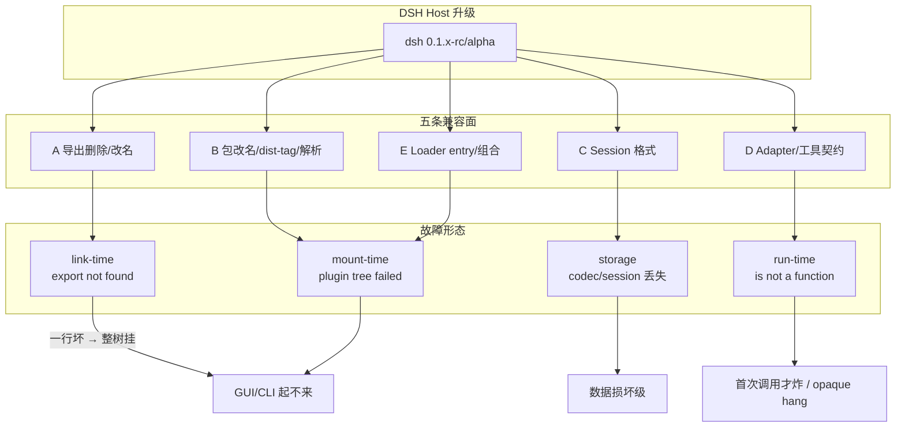

# DeepSeek Harness 升级后新旧插件兼容问题与解决办法

> Generated 2026-09-22 · depth: deep · 55 sources · workspace: research/dsh-plugin-compat/

## Executive summary

- **DSH 仍是 developer preview，官方明文预告兼容性破坏**；2026-08-10 首发至 2026-09-22 共 **24 个版本，全部为 rc/alpha，从未有 stable**。当前 dist-tags：`latest=0.1.5-rc.2`、`next=0.1.5-rc.3`、`alpha=0.1.7-alpha.1` [1][2]。
- **兼容破坏不是单点，而是五条面同时在动**：A 导出删除/改名、B 包改名与 dist-tag/解析、C session 格式、D adapter/工具契约、E loader entry/组合契约 [3][4][16][18][41][43]。
- **整树炸毁的主因是 Cordis loader 单点故障域**：一行 named-export 缺失（如 `settingsNamespace`）会让整棵 plugin tree 在 ESM 链接期失败，GUI 起不来 [11][12][16][17]。
- **0.x prerelease 的 peer 范围是隐性地雷**：`^0.1.0-rc.8` 默认 **不** 匹配 `0.1.2-rc.1`（node-semver 同元组规则）；官方 loader **明确不校验 peer 版本范围** [27][28][53]。
- **`@deepseek-ai/dsh-*` 的 `latest` 被冻在空包 `0.0.1-rc.1`**（发布脚本对含 `-` 的版本只打 `next`），`dsh plugin add` 无版本安装会装到坏构建，并以误导性 export 错误失败——至少 8 次独立上报 [22]。
- **官方拒绝提供迁移工具**（Discussion #7492「不做」），也无 `ctx.host.apiVersion` / throwing stub / Host API change notes / manifest 兼容范围——社区诉求六条全部未落地 [13][42]。
- **社区已有可吸收的结构化知识源**：oh-my-dsh **127 张升级卡**（corridor 边 + 九字段 schema + 七类 touchpoint regex）、dsh-compat-guard 三闸门、grunmin 三层失败分类、pax-beehive Hub 兼容 schema [26][43][55][57][58][59]。
- **同类工具的可迁移门禁**：ncu `--doctor`（乐观全升→二分回退）、`--peer`/`--cooldown`；Renovate `constraintsFiltering`/`minimumReleaseAge`/`postUpgradeTasks`；VS Code `engines.vscode` + 偶奇 minor canary；pnpm `--changeset` 把 peer 变更记 major [33][34][35][37]。
- **对 `dsh-update-copilot` v0.7.0**：A（named-export 硬闸）与 E-peer（prerelease-correct peer 警告）已覆盖；**缺口是 C 存储指纹、D capability probe、127 卡 corridor 索引、禁止 latest 空包安装**。建议 P0 先接卡索引 + 三层分类输出 + 空包拦截 [15][24][26][43]。
- **解决办法总原则**：升级前用 corridor + 五类预检做门禁；升级中钉版本/钉 commit、全树 checkpoint；升级后按 link-time / mount-time / run-time 归因并可回滚。自动 codemod 默认只 dry-run [33][34][38][55]。

---

## Background & scope

**问题**：`dsh-update-copilot`（v0.7.0，面向 DSH `>= 0.1.0-rc.7`）在 DSH 连续升级后可能落后；需要判断最新代码现状、旧插件↔新 host / 新插件↔旧 host 的兼容问题与解决办法，并对照 GitHub Issues 与同类升级插件。

**范围**：`@deepseek-ai/dsh` 及周边包的公开版本与变更；插件安装/加载/更新路径；host 导出、peer、bundle patch、client inject、profile manifest；Issues/Discussions/Releases；Renovate/ncu/VS Code/pnpm/Homebrew 等升级门禁惯例。时间窗以 2026-08-10（DSH 首发）至 2026-09-22 为主。

**假设**（证据已部分修正）：原假设「约 2025-09 起」不成立——包创建于 2026-08-10，可查发布史仅约 6 周 [1]。「新旧插件」按双向理解：新 host 跑旧插件，以及新插件回落旧 host。

**本地基线**：`lib/compat.js` 静态比对 named imports vs host exports；`lib/preflight.js` 实现含 node-semver prerelease 同元组规则的 peer 警告与 breaking 启发式；history/rollback 为单包快照。官方包只报告不自动更新。

---

## 1. DSH 代码与版本现状

### 1.1 发布轨迹与双通道

`@deepseek-ai/dsh` 自 2026-08-10 至 2026-09-22 共 24 个版本，演进为 `0.0.1-rc → 0.1.0-rc → 0.1.1-rc → 0.1.2-alpha/rc → 0.1.3-alpha → 0.1.5-alpha/rc → 0.1.6-alpha → 0.1.7-alpha`，**跳过 0.1.4**；rc 线停在 `0.1.5-rc.3`，alpha 线已到 `0.1.7-alpha.1`——双线并行 [1]。

| dist-tag | 版本 | 含义 |
|---|---|---|
| `latest` | 0.1.5-rc.2 | `npx @deepseek-ai/dsh web` 默认 |
| `next` | 0.1.5-rc.3 | rc 预发布通道 |
| `alpha` | 0.1.7-alpha.1 | 最激进破坏面 |

同仓 `dsh-base` / `dsh-web-app` / `dsh-tools` 与主包同号发版，但 **`latest` 仍卡在 `0.0.1-rc.1`**（空包），`next`/`alpha` 已同步到新线——dist-tag 滞后是系统性的 [1][22]。`@deepseek-ai/cordis` 走独立 `4.0.x` 线（latest 4.0.2，0.1.7-alpha.1 已依赖 `^4.0.3`）[1][63]。

GitHub Releases 使用 `dsh-vX.Y.Z-*` 标签且全部标 Pre-release；**无独立 CHANGELOG**，变更说明只在 Release Notes，且常不标注破坏性 [5][65]。

### 1.2 升级入口（无 `dsh update`）

官方零安装入口始终是 `npx @deepseek-ai/dsh web`；插件管理是 `dsh plugin --profile <name> <pnpm args>` 薄转发器，成功后 reconcile `dsh.profile.bundles` [7][52]。升级 harness 等价于重新解析 npx 或显式钉版本——**不存在专用 update 子命令**。

### 1.3 近两轮高破坏版本（插件视角）

| 版本 | 日期 | 对插件的破坏面 |
|---|---|---|
| **v0.1.6-alpha.1** | 2026-09-15 | PTC 包/服务名统一为 `ptc-runtime`（旧名不兼容）；`workflow-ptc` 改名；`agent/session-start` → 异步串行 `agent/created`；移除内置 E2B；DeepSeek 默认 Messages 协议，旧根地址需改 `https://api.deepseek.com/anthropic` [4] |
| **v0.1.7-alpha.1** | 2026-09-22 | Session 日志 **V4**；仅存于自定义事件的附件不再自动读取/导出；DeepSeek 适配器仅 Messages API；工作区读取统一 **`readBytes`**（插件需迁旧接口）；Agent 预设改由插件组合包声明；`settings.yaml` 一次性导入后由插件配置接管 [3] |

更早的高破坏窗是 **0.1.2 → 0.1.5**：包级移除/改名（`dsh-host-apiproxy`、`dsh-client-store`/`ui-primitives`/`ui-slots`）、`code`→`ptc`、session format V2→V3（只向前）[20][54]。

---

## 2. 兼容破坏面：五类问题与故障形态



### A. 导出删除 / 改名（link-time，整树失败）

`@deepseek-ai/dsh-settings` 现仅 `export type { SettingsNamespace }`，**无** camelCase 值导出 `settingsNamespace`；值导出是 `redactSecrets` / `SettingsConflictError` / 默认 `SettingsForms` [11]。真实事故：

- `dsh-univer-office` import `settingsNamespace` → `does not provide an export named` → 整树失败、GUI 端口不可达 [16]。
- `installSettingsSection` 移除后，单插件 ESM 链接失败即可中止整个应用启动（boot fail-loud）[17]。
- `Session.events` 删除，改走 `seq` / `eventAt()` / `snapshotEvents()` / `ownEvents()`；`tool-subagent-report`→`send_message` 等（升级卡 A4 系列）[61]。

**分界清晰**：optional entry import 失败仅告警继续；required entry（`agent-loop`/`webserver`/`modules`/`connection`/`headless-runner`/`acp`/`sdk-jsonrpc-server`）失败则 dispose 整 app 并 exit 1；bundle resolution/manifest/patch 失败则 **skip 该 layer（静默降级）**；profile 与 user-patch 错误仍 fail startup [12]。

Plugin Manager 另有三态静默降级：`failed` / `overridden` / `restart-required` [8]。

### B. 包改名 / dist-tag / 安装解析（mount-time）

- 包改名实例：`@deepseek-ai/dsh-code-runtime-python` → `@deepseek-ai/dsh-experimental-code-runtime-python` [61]。
- **`latest` 空包冻结**：发布脚本 `families.ts` 对任何含 `-` 的版本只打 `next`，`latest` 永不推进；`dsh plugin add` 无版本即装 `0.0.1-rc.1` 空包（无 `lib/index.js`、无 `dsh.bundle`），并以误导性 export 错误失败 [22]。
- 官方升级脚本曾按 `require.resolve` 的 `.pnpm` realpath **原位覆盖 CLI**，依赖树新旧混版本；旧回滚只换 CLI 不动依赖树，回滚后依旧损坏 [19]。
- pnpm 装 host 可导致 `ERR_MODULE_NOT_FOUND` 拖垮 4–200 条 loader entry；同机 npm/npx 正常 [46]。
- 第二份 `@deepseek-ai/dsh-tools` 会拆开 `Symbol` key，每次 tool call 报 `prepare` undefined 并毒化 session；`pnpm overrides` 钉版本无效，须物理去重 [45]。
- `dsh plugin remove` 失败时留下 stale `dsh.profile.bundles` 条目，profile 拒绝 boot（`cannot resolve profile bundle`），唯一恢复是手改 `package.json` [48]。

### C. Session 格式（storage，数据损坏级）

0.1.5 线 Session log → V3（**只向前迁移**，`downgrade reads are not supported`）；0.1.7-alpha.1 升 **V4**。旧 build 报 `this build has no Session format codec for v3`；社区有「升级后会话全丢」事故 [3][47]。这是比插件挂更严重的面。

### D. Adapter / 工具契约（run-time，首次调用才炸）

- 0.1.0-rc.6 → 0.1.1-rc.2：`registration.adapter.prepareCall is not a function`；对象字面量 adapter 是根因。**正确修法是 peer 继承 host `LlmAdapter` 基类 + `typeof` 能力探测，勿 probe 版本号** [41]。
- 同代还搬走 `system-prompt/assemble`、`tools/pre-execute` 等 waterfall，单查 adapter 不够 [41]。
- `ctx.subagents.registerContinuableSetup` 在 0.1.1-rc.1 → 0.1.2-rc.1 整段消失，且 **无任何 host 版本/能力探测面** [42]。
- 半升级对：CLI 先升 → `modelSelectionSettings requires … in the Host scope`；bridge 先升 → `subpath './model-selection-settings' is not defined by "exports"` [43]。

### E. Loader entry / 组合契约（mount-time）

- peer 范围 `>=0.1.0-rc.5 <0.2.0` **永远选不中 alpha 线**；旧形 `sessionProjectionCache`（无 `hydratePrepared`）被 alpha host 消费后会话历史全挂 [18]。
- `duplicate loader entry id`、`failed to apply loader entry`、`… requires … in the Host scope` 是 mount-time 签名三件套 [43]。
- 一个坏 tool schema 会让整个 session 的所有 API 请求被拒，而不只是那一个 tool [47]。
- 两套 inject 语义不可混：Host `export const inject` = Cordis service 名；`dsh.client.inject` = **信息性包名依赖**（官方类型注释明确 “not Cordis service injection”）[9][51]。client 半部用 `dsh.client` + `exports["./client"]` 组合进 `window.__DSH_BOOT__` [51]。
- `dsh.bundle.patch` 为 `string | string[]`；合成顺序 bundles → profile `cordis.patch.yml` → `$DSH_HOME/cordis.patch.yml` → `--patch`；**later wins per row，且整段替换 `config`（非 deep-merge）** [10][50]。`dsh-base` 是 base-backed profile 的第一层 patch，后续 bundle 用同 id 整行覆盖 [62]。

### 共性根因

不是某个插件不兼容，而是 **框架契约在变且 changelog 未标注破坏性变更** [21]。官方 README 明示 `THERE WILL BE COMPATIBILITY-BREAKING CHANGES` [2]；产品页同样声明核心插件与基础 API 持续迭代 [49]。

---

## 3. 版本/解析层：「看起来兼容、实际已坏」

1. **0.x + prerelease 语义**：SemVer 规定 0.y.z 公共 API 不应视为稳定 [27]。node-semver 默认把 prerelease 锁在同一 `[major,minor,patch]` 元组：`satisfies('0.1.2-rc.1','^0.1.0-rc.8') === false`，开 `includePrerelease` 才为 true；而正式版 `0.1.1` 反而匹配，`0.2.0*` 一律不匹配 [28]。本地 `lib/preflight.js` 的 `setAllowsPrerelease` 已实现该规则——**这点 v0.7.0 是过关的**。
2. **官方不校验 peer 范围**：「规则不会使已加载模块失效，也不校验 peer 版本范围」——预检只能做启发式矩阵，不能依赖 loader 拒绝 [53]。
3. **peer 写法策略**（npm 官方）：插件对 host 的 peer「尽可能宽」，勿锁 patch；可选宿主用 `peerDependenciesMeta.optional` [29]。pnpm `autoInstallPeers` 默认装最高满足版，冲突则静默不装；`strictPeerDependencies` 默认只警告。业界逃生舱：`peerDependencyRules.allowAny` / `allowedVersions` [30]。
4. **dist-tag 陷阱**：裸 install 解析 `latest`；prerelease 流走 `next` 等标签。DSH 子包 `latest` 冻结使「无版本安装」必踩坑 [22][31]。
5. **通道漂移**：`file:`/`link:` 本地检出不自动装自身依赖；git `#commit` 在含 build/prepare 时每次重建——联调通过 ≠ 用户侧安装图正确 [29][32]。
6. **半升级对必须同代移动**：单侧升级分别死在 mount-time 或 run-time [43]。

---

## 4. GitHub Issues / Discussions 故障图谱

官方仓库 **已禁用 Issues**，兼容讨论全在 Discussions [2]。高信号线索：

| 线索 | 模式 | 来源 |
|---|---|---|
| `dsh-update-copilot` #7 | 四类重复炸点归纳（export / peer / pnpm 连带 / changelog 埋雷） | [15] |
| #5363 / #5426 | named export 删除 → 整树 | [16][17] |
| #5450 | 0.x peer 范围选不中 alpha | [18] |
| #5564 | 升级脚本 `.pnpm` realpath 混版本 | [19] |
| #5609 | client 包删除后 require 残留 | [20] |
| #5300 | alpha 四连升四种故障；changelog 不标破坏 | [21] |
| #5813 | `latest` 空包冻结（8+ 独立上报） | [22] |
| #4487 | 社区 compat-guard / plugin-hub 升级门 | [23] |
| #4013 / #6540 | adapter 契约 / Host API 稳定性诉求 | [41][42] |
| `dsh-update-copilot` #8–#13 | 预检六件套已落地（203 tests green） | [15][24] |
| `dsh-update-copilot` #14 | 后台扫描无批次超时可阻塞 web ~400s | [24] |
| stuarthu/dsh-hot-reload | 内置 HMR 故意忽略 `node_modules` | [25] |

**社区对 host 的明确诉求**（#6540，截至 2026-09-22 无官方回应）：`ctx.host.apiVersion`/capability set；被删 API 保留一版 throwing stub；per-release Host API change notes；manifest 声明 `"dsh": ">=0.1.1 <0.1.2"` 并在 boot 打 loud mismatch [42]。

官方在 #7492 对「破坏性更新做迁移工具」的答复是 **「不做」**——兼容/迁移责任外移插件生态 [13]。这直接放大了 `dsh-update-copilot` 类工具的价值。

---

## 5. 同类升级工具的可迁移做法

| 工具 | 可迁移原语 | 映射到 copilot |
|---|---|---|
| **ncu `--doctor`** | 基线测试 → 乐观全升 → 失败逐包回退 → 只写回通过项 | preflight + 选择性回滚 |
| **ncu `--peer` / `--cooldown`** | peer-graph 过滤候选；发布冷却期 | 候选版本过滤；minimumReleaseAge |
| **Renovate `constraintsFiltering:strict`** | 仓库 engines ⊆ 发布 constraint 才放行 | host↔plugin 引擎兼容预检 |
| **Renovate `minimumReleaseAge*`** | pending status 阻 automerge + 30min buffer | 刚发布的版本先不进一键更新 |
| **Renovate `postUpgradeTasks` / `rollbackPrs`** | 升级后 codemod（`allowedCommands` 安全门）；yank 后降级 | 迁移卡 recipe；回滚增强 |
| **VS Code `engines.vscode`** | host 兼容 gate + Insiders 日期 tag + 偶/奇 minor canary | 多通道 host 分发插件的金标准 |
| **pnpm `up --changeset`** | deps→patch、**peerDeps→major** | peer 破坏的显式版本分级 [37] |
| **pnpm `outdated --compatible`** | 只列仍满足 spec 的版本 | 与「可更新」判定对齐 [36] |
| **Homebrew `pin` / `migrate --dry-run` / 多 keg** | 可逆性原语 + 预演 | pin 保护；dry-run 迁移 [38] |
| **update-notifier** | 只通知不自动更 + `type: major\|prerelease` 分级 | 打扰控制与破坏级别标注 [39] |
| **Koishi** | 命名映射 + 细粒度热重载 | 爆炸半径控制（semver/rollback 较弱）[40] |

**关键警告**：Renovate 官方指出 `constraintsFiltering` **不可** 与 `rollbackPrs` 同时开启，否则当前版本可能被误回滚——预检改造与回滚改造的优先级需分开评估 [34]。

---

## 6. 可吸收的结构化知识源（不要自造 schema）

| 知识源 | 可吸收字段 | 覆盖 |
|---|---|---|
| **oh-my-dsh 127 卡** | frontmatter `from/to/status/coverage/cardCount/idPrefix/verifiedAt`；单卡九字段（Type / Touchpoints #1–#7 / Action level / Migration recipe old→new / Verification / Source）；**corridor 缺边必须 stop** | A–E 全覆盖 [26][58][61] |
| **pre-flight-patterns.json** | 七类 regex：source-patch / internal-events / internal-services / host-filesystem / internal-ui-commands / custom-channel / subprocess-output | 静态触点 [59] |
| **dsh-compat-guard** | 三闸门 exit 1/2；`dsh.compat.{requires,tested,storageFormats,kind}`；`status∈{pass,fail,unknown}+evidence`；存储魔数；`dsh.guard.lock.json`（integrity/configHash） | C + 矩阵 + 回滚 [55][56] |
| **grunmin acp-doctor** | link-time / mount-time / run-time + stderr 签名→修复映射；api-surface-check 声明面白名单 | B/D/E [43][44] |
| **pax-beehive hub schemas** | `compatibilitySchema{dsh,node,platforms,surfaces,hmr}`；`entryIds/before/after`；`source.integrity` | E + 发布元数据 [57] |
| **verify-runtime.mjs** | verdict∈{activation-failed, service-wait-unresolved, env-needs-service-host, load-crash-module-resolve, pass-boot-probe, ambiguous} + attribution | 装后归因 [60] |

升级卡 corridor 按 **from→to 边** 组织（0.1.0-rc.8 → 0.1.5-rc.2 共 14 条边）；跨版本预检应先建 corridor 再折叠净变更——「removed then restored」不可先删后加 [26][58]。

---

## 7. 对 dsh-update-copilot 的改造优先级

### P0 — 立刻做（消掉已证实的整树炸毁类）

1. **接入 127 卡 corridor 索引**  
   消费 oh-my-dsh frontmatter + 单卡字段；`update_copilot_preflight` 按「当前 host → 目标 host」折叠净变更，输出 `hit touchpoints × applicable cards × action level`。缺 corridor 边 → **blocked**（与 oh-my-dsh 同规则）。  
   *理由*：破坏性变更埋在 release notes 正文；127 卡已是 curated + pinned 的现成结构化知识 [15][21][26][58]。

2. **预检输出对齐三层失败分类**  
   扩展现有 export 硬闸 / peer 警告字段为 `layer: link-time | mount-time | run-time | storage | peer | breaking-card` + `subject` + `fix`（签名表见 acp-doctor）。  
   *理由*：半升级对硬失败可被三分类稳定捕获；也是 #5609「红黄绿清单」的最小可交付 [20][43][44]。

3. **禁止解析 `latest` 空包 / 强制钉版本**  
   扫描已忽略 `latest` 比较，但安装路径仍可能装到 `latest=0.0.1-rc.1` 空包。目标 spec 无版本且 registry `latest` 缺 `lib/index.js` / 无 `dsh.bundle` → **blocked**，改写为显式 version 或 `next`/`alpha`。  
   *理由*：#5813 家族 8 次独立上报 [22]。

### P1 — 下一迭代（补齐 C/D）

4. **存储格式指纹闸门**：目标 host 的 `sessionFormat`/`projcacheVersion` 与当前不一致 → blocked（或 snapshot 后 force）。魔数扫描（zstd `28 B5 2F FD` / sqlite），对齐 dsh-compat-guard；未知格式只警告/备份，不猜测转换 [3][47][55][56]。
5. **Adapter/工具契约 capability probe**：对 host 方法面做 `typeof` 探测（**probe capability, never version string**），至少覆盖 `LlmAdapter.prepareCall`、Session 替代面、`tool-subagent-control` [41][42]。
6. **post-update codemod 钩子（默认 dry-run）**：卡片 Migration recipe 的 old→new ledger 做成可选自动替换；对齐 Renovate `postUpgradeTasks` 但默认只建议不执行 [34][58]。

### P2 — 结构性（兼容模型）

7. **插件侧兼容元数据**：读取/推动 `dsh.compat.{requires,tested,storageFormats,kind}` + Hub `compatibilitySchema` + `entryIds/before/after`。优先级：实测矩阵 > 作者元数据 > `untested` 警告（不硬拦）[55][57]。
8. **发布冷却期 + peer 破坏分级**：ncu `--cooldown` / Renovate `minimumReleaseAge` + pnpm「peer 变更 = major」；`Type: breaking` 卡触发的升级默认不进「Update all」[33][34][37]。
9. **声明面白名单 CI**（防自己成为下一批半升级死样本）：只 import host published exports / 官方声明 seam [43]。

### 建议的预检输出契约（最小字段集）

```json
{
  "decision": "ok | warning | blocked",
  "corridor": { "from": "dsh-v0.1.5-rc.2", "to": "dsh-v0.1.6-alpha.2", "edges": 2, "missingEdge": false },
  "layerFindings": [
    {
      "layer": "link-time | mount-time | run-time | storage | peer | breaking-card",
      "subject": "…",
      "actionLevel": "required | required-if-hit | conditional | optional | informational",
      "touchpoints": [1, 3, 5],
      "cards": ["DSH-0.1.2-A4-03"],
      "evidence": "…",
      "fix": "…"
    }
  ],
  "peerWarnings": [],
  "storageFormats": { "current": "zstd-jsonl", "target": "zstd-jsonl", "projcacheVersion": [3, 4] },
  "forceAvailable": true
}
```

与现有 `ok/warning/blocked + blocker evidence + peer warnings + breaking signals` 向后兼容。

---

## 8. 用户侧：旧插件 / 新插件的解决办法

### 新 host × 旧插件

1. **升级前**跑 preflight：named-export diff、peer（含 prerelease 规则）、corridor 卡、存储指纹；`decision=blocked` 不要 force，除非已 snapshot。
2. **钉版本安装**：`dsh plugin add <name>@<version>` 或 `github:owner/repo#<sha>`，禁止裸名（会踩 `latest` 空包）[22][50]。
3. **同代移动**：host 与 bridge/adapter 类插件一起升；半升级对必死一侧 [43]。
4. **物理去重** `@deepseek-ai/dsh-tools` 等单例 Symbol 包（exports 面 `.`/`./types`/`./invariant`/`./presentation`）；overrides 不够 [45][64]。
5. **link-time 炸了**：用离线 CLI / `cordis.patch.yml` 禁用片段 / `dsh plugin remove` 先救启动（本仓已有）[15]。
6. **run-time 才炸**：按 capability probe 分支，或升级插件到实现新契约的版本（如 vision-router v1.7.6）[41]。
7. **session 格式跳变**：先备份 `$DSH_HOME`；V3/V4 只向前，旧 build 读不了新日志 [3][47]。

### 新插件 × 旧 host

1. peer 写宽（`>=0.1.0-rc.7 <0.2.0` 或按需 `||` 并联 rc/alpha），勿锁 patch [29]。
2. 对可选 host 用 `peerDependenciesMeta.optional` [29]。
3. 能力探测代替版本探测：`typeof LlmAdapter.prototype.prepareCall === 'function'` [41]。
4. 声明 `dsh.compat.{requires,tested}`（社区契约）——在官方落地前作为软信号 [42][55]。
5. 双面插件核对 `dsh.client.inject`（包名）≠ Host `inject`（service）[9]。

### 通用护栏

- 全树 checkpoint（`.pnpm`）再动依赖；失败整树回滚——copilot 当前快照仅单包，是明确缺口 [23][55]。
- 热重载有边界：内置 HMR 忽略 `node_modules`；bundle patch / lockfile 变更仍需重启 [25]。
- 自动迁移默认 dry-run；Renovate 警告 rollback 与 constraints 过滤不可混用 [34]。

---

## Comparison table

| 方案 | 五类覆盖 | 预检 | 回滚 | 知识源 | 自动迁移 |
|---|---|---|---|---|---|
| **dsh-update-copilot v0.7.0** | A✅ E-peer⚠️ B⚠️ C❌ D❌ | export 硬闸 + peer 警 + breaking 启发式 | 单包快照/回滚 | commit/release 启发式 | 无（一键更新） |
| **oh-my-dsh 127 卡** | A–E | 七类 touchpoint regex | 手工 recipe | **最全 curated** | 人工执行 |
| **dsh-compat-guard** | C + 矩阵 | 三闸门 exit 1/2 | **全量自动备份** | compat.json | 无 |
| **dsh-plugin-hub** | E | 适配门 | **`.pnpm` 全树** | Hub schema | 强制禁用待适配 |
| **grunmin acp-doctor** | B/D/E | 三层 stderr 分类 | 手工 | doctor 映射表 | 迁移计划文档 |
| **ncu --doctor + --peer** | 通用依赖 | peer + cooldown | 二分回退 | registry | 测试驱动 |
| **Renovate** | 通用 | constraints + release age | rollbackPrs* | 可配置 | postUpgradeTasks |
| **VS Code engines** | host 兼容 | Marketplace gate | 用户侧 | 官方 API | Migrate 按钮 |

\* Renovate 官方警告勿与 `constraintsFiltering` 同开 [34]。

---

## Open questions

1. **0.1.5-rc.2 vs 0.1.7-alpha.1 的插件 API 完整 diff** 尚未逐符号展开；当前依赖 release notes + 升级卡，0.1.6/0.1.7 的卡可能滞后于 npm（alpha 已含 Session V4）[1][3][4][26]。
2. **`dsh-base`/`dsh-web-app` 的 `latest` 冻结**是发布流水线 bug 还是刻意策略？是否影响 `npx` 依赖树解析 [1][22]。
3. **Discussion #6540 的 Host API 提案**（`apiVersion` / throwing stub / manifest range）若落地，copilot 应从探测式切换为声明式——需持续跟踪 [42]。
4. **`@deepseek-ai/cordis@4.0.3` / `cordis-plugin-loader@1.0.4`**（2026-09-22 刚发）相对 4.0.2/1.0.3 的 Loader 契约是否再变 [63]。
5. **compat-guard `lib/formats.json` 自承 seed-only**，rc.7 存储布局仍 unknown——存储闸门需 registry 回退策略 [55]。
6. **升级卡 corridor 在 0.1.5-rc.2 之后**的边仍是 draft/等认领；缺边 stop 规则下，alpha 线自动迁移目前不可用 [26][58]。
7. **官方为何拒绝迁移工具**（#7492）——若政策不变，社区 schema 的互通（copilot × oh-my-dsh × compat-guard × Hub）比等待官方更重要 [13]。

---

## Sources

[1] npm registry `@deepseek-ai/dsh` packument — https://registry.npmjs.org/@deepseek-ai/dsh (accessed 2026-09-22)

[2] DeepSeek Harness README（developer preview / breaking changes）— https://github.com/deepseek-ai/deepseek-harness (accessed 2026-09-22)

[3] Release dsh-v0.1.7-alpha.1 — https://github.com/deepseek-ai/deepseek-harness/releases/tag/dsh-v0.1.7-alpha.1 (published 2026-09-22, accessed 2026-09-22)

[4] Release dsh-v0.1.6-alpha.1 — https://github.com/deepseek-ai/deepseek-harness/releases/tag/dsh-v0.1.6-alpha.1 (published 2026-09-15, accessed 2026-09-22)

[5] Release dsh-v0.1.5-rc.1 — https://github.com/deepseek-ai/deepseek-harness/releases/tag/dsh-v0.1.5-rc.1 (published 2026-09-10, accessed 2026-09-22)

[6] Release dsh-v0.1.2-rc.1 — https://github.com/deepseek-ai/deepseek-harness/releases/tag/dsh-v0.1.2-rc.1 (published 2026-09-03, accessed 2026-09-22)

[7] apps/cli README — https://github.com/deepseek-ai/deepseek-harness/blob/master/apps/cli/README.md (accessed 2026-09-22)

[8] host-plugin skill reference — https://github.com/deepseek-ai/deepseek-harness/blob/main/packages/preset/agent-preset/skills/cordis-plugin-development/references/host-plugin.md (accessed 2026-09-22)

[9] package-manifest `types.ts` — https://github.com/deepseek-ai/deepseek-harness/blob/main/packages/util/package-manifest/src/types.ts (accessed 2026-09-22)

[10] 发布/组合包文档 `publish.md` — https://github.com/deepseek-ai/deepseek-harness/blob/main/docs/user/develop/basic/publish.md (accessed 2026-09-22)

[11] `@deepseek-ai/dsh-settings` index.ts — https://github.com/deepseek-ai/deepseek-harness/blob/main/packages/settings/settings/src/index.ts (accessed 2026-09-22)

[12] app-boot README — https://github.com/deepseek-ai/deepseek-harness/blob/main/packages/boot/app-boot/README.md (accessed 2026-09-22)

[13] Discussion #7492（迁移工具「不做」）— https://github.com/deepseek-ai/deepseek-harness/discussions/7492 (published 2026-09-22, accessed 2026-09-22)

[14] Client plugin loading model note — https://github.com/deepseek-ai/deepseek-harness/blob/main/.agents/notes/implemented/architecture/2026-07-23-client-plugin-loading-model.md (published 2026-07-23, accessed 2026-09-22)

[15] hezhongtang/dsh-update-copilot #7 — https://github.com/hezhongtang/dsh-update-copilot/issues/7 (published 2026-09-05, accessed 2026-09-22)

[16] Discussion #5363（settingsNamespace）— https://github.com/deepseek-ai/deepseek-harness/discussions/5363 (accessed 2026-09-22)

[17] Discussion #5426（installSettingsSection）— https://github.com/deepseek-ai/deepseek-harness/discussions/5426 (accessed 2026-09-22)

[18] Discussion #5450（peer range / alpha）— https://github.com/deepseek-ai/deepseek-harness/discussions/5450 (accessed 2026-09-22)

[19] Discussion #5564（`.pnpm` realpath 升级事故）— https://github.com/deepseek-ai/deepseek-harness/discussions/5564 (published 2026-09-04, accessed 2026-09-22)

[20] Discussion #5609（client 包删除）— https://github.com/deepseek-ai/deepseek-harness/discussions/5609 (accessed 2026-09-22)

[21] Discussion #5300（alpha 四连升故障）— https://github.com/deepseek-ai/deepseek-harness/discussions/5300 (accessed 2026-09-22)

[22] Discussion #5813（`latest` 空包冻结）— https://github.com/deepseek-ai/deepseek-harness/discussions/5813 (published 2026-09-07, accessed 2026-09-22)

[23] Discussion #4487（compat-guard / plugin-hub）— https://github.com/deepseek-ai/deepseek-harness/discussions/4487 (published 2026-08-25, accessed 2026-09-22)

[24] hezhongtang/dsh-update-copilot #14 — https://github.com/hezhongtang/dsh-update-copilot/issues/14 (published 2026-09-12, accessed 2026-09-22)

[25] stuarthu/dsh-hot-reload — https://github.com/stuarthu/dsh-hot-reload (accessed 2026-09-22)

[26] oh-my-dsh/dsh-plugin-upgrade-skill — https://github.com/oh-my-dsh/dsh-plugin-upgrade-skill (accessed 2026-09-22)

[27] SemVer 2.0.0 — https://semver.org/ (accessed 2026-09-22)

[28] node-semver — https://github.com/npm/node-semver (accessed 2026-09-22)

[29] npm Docs: package.json — https://docs.npmjs.com/cli/v11/configuring-npm/package-json (accessed 2026-09-22)

[30] pnpm: peer dependencies — https://pnpm.io/settings/peer-dependencies (accessed 2026-09-22)

[31] npm Docs: dist-tag — https://docs.npmjs.com/cli/v11/commands/npm-dist-tag (published 2025-10-04, accessed 2026-09-22)

[32] npm Docs: package-spec — https://docs.npmjs.com/cli/v11/using-npm/package-spec (published 2026-02-11, accessed 2026-09-22)

[33] npm-check-updates — https://github.com/raineorshine/npm-check-updates (accessed 2026-09-22)

[34] Renovate configuration-options — https://raw.githubusercontent.com/renovatebot/renovate/main/docs/usage/configuration-options.md (accessed 2026-09-22)

[35] VS Code: Publishing Extensions — https://code.visualstudio.com/api/working-with-extensions/publishing-extension (published 2026-09-16, accessed 2026-09-22)

[36] pnpm: outdated — https://pnpm.io/cli/outdated (accessed 2026-09-22)

[37] pnpm: update — https://pnpm.io/cli/update (accessed 2026-09-22)

[38] Homebrew Manpage — https://docs.brew.sh/Manpage (accessed 2026-09-22)

[39] update-notifier — https://raw.githubusercontent.com/yeoman/update-notifier/main/readme.md (accessed 2026-09-22)

[40] Koishi 插件指南 — https://koishi.chat/zh-CN/guide/plugin.html (accessed 2026-09-22)

[41] Discussion #4013（prepareCall / LlmAdapter）— https://github.com/deepseek-ai/deepseek-harness/discussions/4013 (published 2026-08-22/26, accessed 2026-09-22)

[42] Discussion #6540（Host API stability 诉求）— https://github.com/deepseek-ai/deepseek-harness/discussions/6540 (published 2026-09-13, accessed 2026-09-22)

[43] grunmin/dsh-acp-enhanced — https://github.com/grunmin/dsh-acp-enhanced (accessed 2026-09-22)

[44] acp-doctor.mjs — https://github.com/grunmin/dsh-acp-enhanced/blob/main/scripts/acp-doctor.mjs (published 2026-09-19, accessed 2026-09-22)

[45] dshdocs: reading-prepare-plugin-crash — https://dshdocs.com/troubleshooting/reading-prepare-plugin-crash/ (published 2026-09-14, accessed 2026-09-22)

[46] dshdocs: failed-to-import-loader-entry — https://dshdocs.com/troubleshooting/failed-to-import-loader-entry-ui-plan/ (published 2026-09-14, accessed 2026-09-22)

[47] dshdocs: cannot-open-sessions-after-upgrade — https://dshdocs.com/troubleshooting/cannot-open-sessions-after-upgrade/ (published 2026-09-14, accessed 2026-09-22)

[48] dshdocs: plugin-remove-stale-bundle — https://dshdocs.com/troubleshooting/plugin-remove-stale-bundle/ (published 2026-09-14, accessed 2026-09-22)

[49] DeepSeek Harness 产品页 — https://www.deepseek.com/harness/ (accessed 2026-09-22)

[50] 官方 develop/basic/publish — https://deepseek-harness.github.io/deepseek-harness/develop/basic/publish (accessed 2026-09-22)

[51] client-modules 参考 — https://deepseek-harness.github.io/deepseek-harness/reference/subsystems/client-modules (accessed 2026-09-22)

[52] CLI reference（zh）— https://raw.githubusercontent.com/deepseek-ai/deepseek-harness/master/apps/cli/reference/README.zh.md (accessed 2026-09-22)

[53] publish.zh.md（peer 不校验）— https://raw.githubusercontent.com/deepseek-ai/deepseek-harness/master/docs/user/develop/basic/publish.zh.md (accessed 2026-09-22)

[54] deepseekdocs: upgrade-migration — https://deepseekdocs.com/docs/guides/upgrade-migration (accessed 2026-09-22) [single source · community]

[55] Shizuku-keop/dsh-compat-guard — https://github.com/Shizuku-keop/dsh-compat-guard (published 2026-08-25, accessed 2026-09-22)

[56] dsh-compat-guard compat/schema.json — https://github.com/Shizuku-keop/dsh-compat-guard/blob/main/compat/schema.json (published 2026-08-25, accessed 2026-09-22)

[57] pax-beehive/dsh-hub-cli schemas — https://github.com/pax-beehive/dsh-hub-cli/blob/main/packages/schemas/src/index.ts (accessed 2026-09-22)

[58] oh-my-dsh card / pre-flight 格式 — https://github.com/oh-my-dsh/dsh-plugin-upgrade-skill/blob/main/skills/plugin-upgrade/references/README.md (accessed 2026-09-22)

[59] pre-flight-patterns.json — https://github.com/oh-my-dsh/dsh-plugin-upgrade-skill/blob/main/skills/plugin-upgrade/references/pre-flight-patterns.json (accessed 2026-09-22)

[60] verify-runtime.check.mjs — https://github.com/oh-my-dsh/dsh-plugin-upgrade-skill/blob/main/skills/plugin-upgrade/scripts/verify-runtime.check.mjs (accessed 2026-09-22)

[61] 升级卡 v0.1.2-alpha.4 — https://github.com/oh-my-dsh/dsh-plugin-upgrade-skill/blob/main/skills/plugin-upgrade/references/v0.1.2-alpha.4.md (published 2026-09-02, accessed 2026-09-22)

[62] `@deepseek-ai/dsh-base` npm — https://www.npmjs.com/package/@deepseek-ai/dsh-base (accessed 2026-09-22)

[63] `@deepseek-ai/cordis` npm — https://www.npmjs.com/package/@deepseek-ai/cordis (accessed 2026-09-22)

[64] `@deepseek-ai/dsh-tools` npm — https://www.npmjs.com/package/@deepseek-ai/dsh-tools (accessed 2026-09-22)

[65] GitHub Releases 列表 — https://github.com/deepseek-ai/deepseek-harness/releases (accessed 2026-09-22)

---

## 附录：证据文件

| 角度 | 文件 | 条数 |
|---|---|---|
| DSH 版本与发布轨迹 | `findings/F1.md` | 13 |
| 插件加载与 Host API 面 | `findings/F2.md` | 16 |
| Issues/兼容讨论 | `findings/F3.md` | 14 |
| 版本/peer/semver 坑 | `findings/F4.md` | 18 |
| 同类升级工具门禁 | `findings/F5.md` | 15 |
| 社区真实故障 | `findings/F6.md` | 15 |
| 官方作者文档 | `findings/F7.md` | 17 |
| 结构化破坏性变更知识源 | `findings/F8.md` | 13 |

综合草稿（子代理产出，本报告已吸收并校订）：`T5-compat-synthesis.md`。
